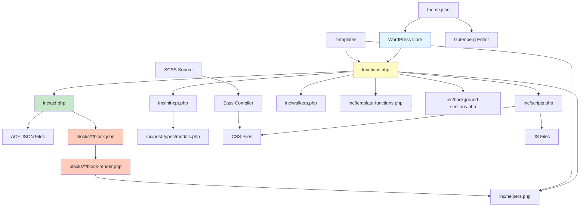
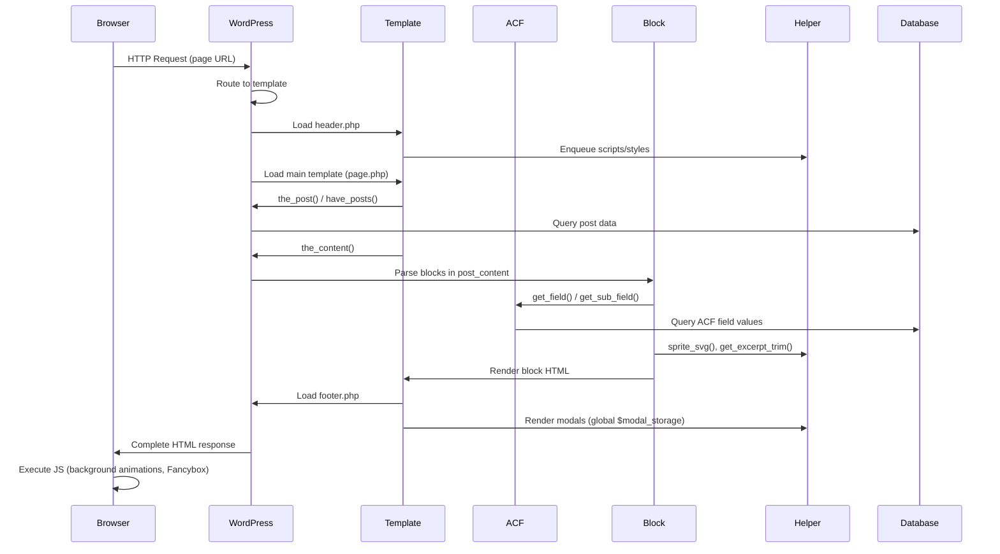
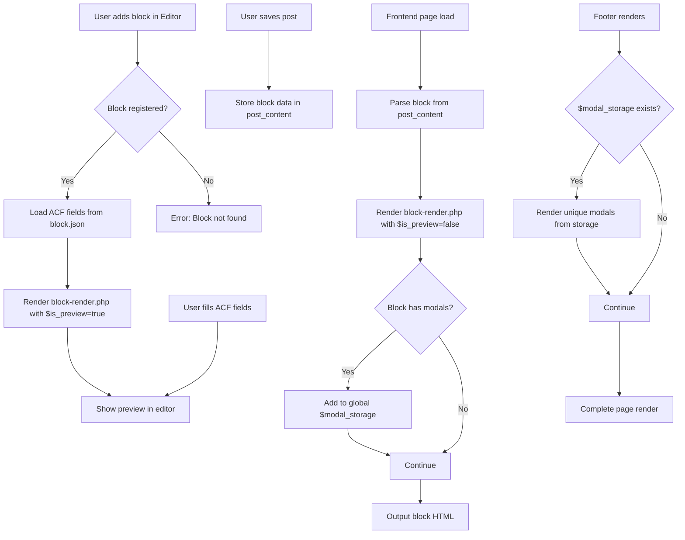
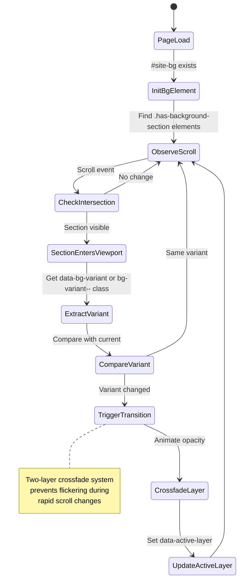

# 01-architecture.md

## Architecture Overview

curixus Project follows a **layered WordPress theme architecture** with clear separation of concerns:

## Layers

### 1. Presentation Layer (Templates)
- **Location**: Root directory (`*.php`), `/template-parts/`, `/page-templates/`
- **Responsibility**: HTML structure, WordPress template hierarchy, content rendering
- **Key files**: `header.php`, `footer.php`, `page.php`, `single.php`, `archive.php`, `404.php`

### 2. Block Layer (Custom Gutenberg Blocks)
- **Location**: `/blocks/*`
- **Responsibility**: Self-contained ACF-powered Gutenberg blocks with rendering logic
- **Structure**: Each block has its own directory with:
  - `block.json` - Block definition and configuration
  - `block-render.php` - Server-side rendering template
  - `style.scss` / `style.css` - Block-specific styles

### 3. Application Layer (Theme Logic)
- **Location**: `/inc/*.php`
- **Responsibility**: Theme setup, WordPress hooks, feature implementation
- **Modules**:
  - `scripts.php` - Asset enqueuing
  - `acf.php` - ACF configuration and block registration
  - `init-cpt.php` - Custom post types loader
  - `helpers.php` - Utility functions
  - `walkers.php` - Custom menu walkers
  - `template-functions.php` - WordPress hooks and filters
  - `template-tags.php` - Template helper functions
  - `customizer.php` - Theme customizer settings
  - `custom-header.php` - Custom header feature
  - `background-sections.php` - Scroll-driven background system

### 4. Data Layer (ACF & WordPress)
- **Location**: `/acf-json/*.json`
- **Responsibility**: Field group definitions, custom field schemas
- **Storage**: Version-controlled JSON files for ACF field groups
- **Post Types**: Custom post types defined in `/inc/post-types/*.php`

### 5. Asset Layer (Styles & Scripts)
- **Location**: `/scss/` (source), `/css/` (compiled), `/js/`
- **Responsibility**: Styling and interactive behaviors
- **SCSS Structure**:
  - `_variable.scss` - Variables, mixins, breakpoints
  - `_reset.scss` - CSS reset/normalize
  - `_components.scss` - Reusable UI components
  - `_header.scss` - Header styles
  - `_footer.scss` - Footer styles
  - `_bg.scss` - Background animation styles
  - `_structure.scss` - Layout and structure
  - `style.scss` - Main import file

## Modules/Domains

### Core Domains

1. **Theme Setup** (`functions.php`)
   - WordPress feature support registration
   - Content width configuration
   - Widget areas
   - Navigation menus
   - Module loading

2. **Content Blocks** (`/blocks/`)
   - Button Group block (with modal support)
   - Card Tiles block
   - Future blocks follow same pattern

3. **Custom Post Types** (`/inc/post-types/`)
   - Modals (for popup content)
   - Extensible pattern for additional CPTs

4. **Navigation System** (`inc/walkers.php`)
   - Header menu walker (multi-level with icons support)
   - Footer menu walker (with label support)
   - ACF integration for menu item customization

5. **Visual Effects** (`inc/background-sections.php`, `js/background-sections.js`)
   - Scroll-driven animated backgrounds
   - Multiple color variants
   - Intersection Observer-based transitions

6. **Asset Management** (`inc/scripts.php`)
   - CSS/JS enqueuing with cache busting (filemtime)
   - Admin-specific styles
   - Block editor scripts

7. **ACF Integration** (`inc/acf.php`)
   - ACF JSON sync (save/load)
   - Automatic block registration from `/blocks/` directory
   - Custom block categories
   - Options page (Site Settings)

8. **Helpers & Utilities** (`inc/helpers.php`)
   - SVG sprite system
   - SVG upload support
   - Excerpt generation
   - YouTube ID extraction
   - Contact Form 7 customization
   - Modal storage and rendering system

## Dependency Rules

### Hard Dependencies
- **WordPress Core** ← All theme code
- **ACF Plugin** ← Custom blocks, field groups, options pages
- **jQuery** ← Main theme JavaScript (jquery.main.js)
- **Sass** ← SCSS compilation (dev only)

### Internal Dependencies
- **Templates** → Application Layer (inc/*)
- **Blocks** → ACF configuration + Helpers
- **Application Layer** → Data Layer (ACF JSON)
- **Assets (JS)** → DOM elements from Templates
- **SCSS partials** → Variables file

### Prohibited Dependencies
- Blocks MUST NOT depend on each other
- Helper functions MUST NOT depend on specific templates
- SCSS files MUST NOT have circular imports

## Module Dependency Diagram



## Request/Response Flow Diagram



## Block Rendering Flow



## Background Animation System



## File Organization Pattern

```
curixus-project/
├── Root Templates (WordPress hierarchy)
├── blocks/                    # ACF Blocks (isolated)
│   └── [block-name]/
│       ├── block.json         # Block registration
│       ├── block-render.php   # Server-side rendering
│       └── style.scss/.css    # Block styles
├── inc/                       # Application logic (modular)
│   ├── scripts.php            # Asset loading
│   ├── acf.php                # ACF setup
│   ├── init-cpt.php           # CPT loader
│   ├── helpers.php            # Utilities
│   ├── walkers.php            # Menu walkers
│   ├── template-*.php         # Template helpers
│   ├── background-sections.php
│   └── post-types/            # CPT definitions
├── acf-json/                  # ACF field groups (data)
├── scss/                      # SCSS source
├── css/                       # Compiled CSS
├── js/                        # JavaScript
├── images/                    # Static assets
└── template-parts/            # Reusable template partials
```

## Scaling Considerations

### Adding New Blocks
1. Create directory in `/blocks/[new-block-name]/`
2. Add `block.json` with ACF configuration
3. Create `block-render.php` for rendering logic
4. Add `style.scss` for block-specific styles
5. Block automatically registers via `inc/acf.php`

### Adding New Custom Post Types
1. Create file in `/inc/post-types/[cpt-name].php`
2. Add file reference to `init-cpt.php` array
3. Flush rewrite rules (automatic on theme switch)

### Adding New Helper Functions
- Add to `inc/helpers.php` if general-purpose
- Create new file in `/inc/` if feature-specific
- Require in `functions.php`

### Design System Extension
- Add colors/gradients to `theme.json`
- Add SCSS variables to `scss/_variable.scss`
- Add spacing/typography scales to `theme.json`

