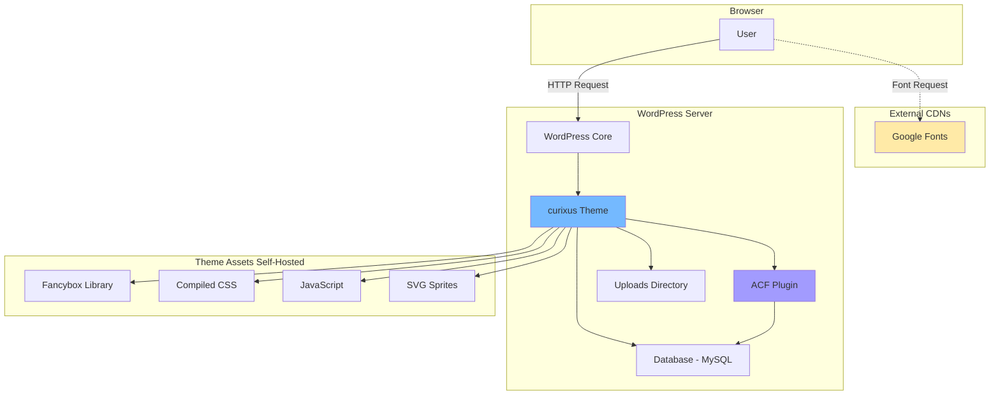

# 04-integrations-and-infra.md

## External Integrations & Infrastructure

This document describes all external services, third-party integrations, and infrastructure configuration used in the curixus Project theme.

## External Services & Libraries

### 1. Google Fonts

**Service**: Google Fonts CDN

**Purpose**: Web typography hosting

**Integration Location**: `header.php` (lines 28-30)

**Fonts Used**:
- **Montserrat**: Primary font family (weights 100-900, normal + italic)
- **Bricolage Grotesque**: Secondary font family (variable font, optical sizes 12-96, weights 200-800)

**Implementation**:
```html
<link rel="preconnect" href="https://fonts.googleapis.com">
<link rel="preconnect" href="https://fonts.gstatic.com" crossorigin>
<link href="https://fonts.googleapis.com/css2?family=Bricolage+Grotesque:opsz,wght@12..96,200..800&family=Montserrat:ital,wght@0,100..900;1,100..900&display=swap" rel="stylesheet">
```

**Configuration**:
- Uses `preconnect` for performance optimization
- `display=swap` for FOIT prevention (flash of invisible text)

**When to modify**: Add/remove font families or weights in both `header.php` and `theme.json`

---

### 2. Fancybox

**Library**: Fancybox v6.1.7

**Purpose**: Lightbox/modal functionality

**Source**: Self-hosted UMD bundle

**Files**:
- `css/fancybox.css` - Styles
- `js/fancybox.umd.js` - JavaScript library

**Integration Location**: `inc/scripts.php`

**Enqueuing**:
```php
wp_enqueue_style("fancybox", get_template_directory_uri() . "/css/fancybox.css", '', filemtime(...));
wp_enqueue_script('fancybox', get_template_directory_uri() . '/js/fancybox.umd.js', '', '6.1.7', true);
```

**Usage**:
- Trigger via `data-fancybox` attribute
- Target via `data-src="#element-id"`
- Configured in `js/jquery.main.js`

**When to modify**: Update library files manually (no CDN used for stability)

---

### 3. Advanced Custom Fields (ACF)

**Type**: WordPress Plugin (required dependency)

**Purpose**: 
- Custom field management
- Block registration and field binding
- Options pages
- Field group version control (ACF JSON)

**Integration Locations**:
- `inc/acf.php` - ACF configuration
- `acf-json/*.json` - Field group definitions (version controlled)

**Key Features Used**:
- ACF Blocks (v3 API)
- ACF JSON sync
- Options pages
- Repeater fields
- SVG icon field (via plugin)

**Configuration**:
```php
// Save ACF JSON to theme
add_filter('acf/settings/save_json', 'em_acf_save_json_path');

// Load ACF JSON from theme (supports child themes)
add_filter('acf/settings/load_json', 'em_acf_load_json_paths');

// Auto-register all blocks in /blocks/ directory
add_action('acf/init', 'register_my_blocks');
```

**Options Pages**:
- **Site Settings** (`post_id: 'options'`) - Global theme settings (footer info, etc.)

**When to modify**: 
- Edit field groups in WordPress admin (auto-saves to `/acf-json/`)
- Commit ACF JSON files to version control
- Never manually edit JSON files (use ACF admin)

---

### 4. Contact Form 7 (Optional)

**Type**: WordPress Plugin (soft dependency)

**Purpose**: Form handling

**Integration Location**: `inc/helpers.php`

**Customizations**:
- Removes auto `<br>` and `<p>` tags (`wpcf7_autop_or_not`)
- Custom checkbox/radio markup (`wpcf7_form_elements` filter)
- Custom checkbox structure: `.checkbox-holder`, `.checkbox-item`, `.checkbox-holder__input`, `.checkbox-holder__label`

**When to use**: Forms requiring submissions (contact forms, lead gen, etc.)

---

### 5. WordPress Block Editor (Gutenberg)

**Type**: WordPress Core Feature

**Purpose**: Content editing interface

**Configuration File**: `theme.json`

**Integrations**:
- Custom color palette (14 colors + variations)
- Custom gradients (8 gradient presets)
- Typography scale (8 sizes: H1-H6, B1-B2)
- Spacing scale (17 sizes: 1rem-17rem)
- Font families (Montserrat, Bricolage Grotesque)
- Custom block categories (`yh_project`, `extra`)
- Block style registration (`js/block-styles.js`)

**Editor-Only Assets**: `inc/scripts.php`
```php
// Block editor JavaScript
add_action('enqueue_block_editor_assets', 'mytheme_register_block_styles');

// Post-type specific editor CSS
add_action('enqueue_block_editor_assets', 'curixus_project_editor_post_type_styles');
```

---

## Configuration Patterns

### No Environment Variables

This theme does **not use** `.env` files or environment variables.

All configuration is stored in:
- **WordPress options** (via Settings API, Customizer, ACF Options)
- **theme.json** (Gutenberg settings)
- **PHP constants** (`functions.php` - e.g., `_S_VERSION`)

---

### Theme Constants

**Location**: `functions.php`

```php
define( '_S_VERSION', '1.0.0' ); // Theme version for cache busting
```

**When to modify**: Bump version on releases to invalidate cached assets.

---

### Customizer Settings

**Location**: `inc/customizer.php`

**Available Settings**:
- Custom header logo
- Dark header logo
- Footer logo
- (Additional settings can be added here)

**Access in templates**:
```php
$logo_id = get_theme_mod( 'custom_logo' );
$dark_logo_id = get_theme_mod( 'dark_header_logo' );
$footer_logo_id = get_theme_mod( 'footer_logo' );
```

---

### ACF Options Pages

**Location**: `inc/acf.php`

**Available Options Pages**:
- **Site Settings** (menu title: "Site Settings")

**Access in templates**:
```php
the_field( 'footer_info', 'option' );
$value = get_field( 'field_name', 'option' );
```

**When to add**: Create via ACF admin → Options Pages.

---

### SVG Sprite Configuration

**Files**:
- `images/icons.svg` - UI icons (default sprite)
- `images/socials.svg` - Social media icons

**Helper Function**: `sprite_svg()` in `inc/helpers.php`

**Cache Busting**: Uses `filemtime()` query param in helper function

**When to modify**: 
1. Edit SVG sprite files directly
2. Use unique IDs for each icon: `<symbol id="icon-name">`
3. Reference via `sprite_svg('icon-name', '24', '24')`

---

## Logging & Monitoring

### No Custom Logging Implemented

This theme relies on **WordPress core debugging**:

**Enable in `wp-config.php`**:
```php
define( 'WP_DEBUG', true );           // Enable debug mode
define( 'WP_DEBUG_LOG', true );       // Log to /wp-content/debug.log
define( 'WP_DEBUG_DISPLAY', false );  // Don't show errors on site
define( 'SCRIPT_DEBUG', true );       // Use non-minified core scripts
```

**Log Location**: `/wp-content/debug.log`

**What gets logged**:
- PHP errors
- WordPress deprecation notices
- Custom `error_log()` calls

**When to use**: Development and debugging only. Disable in production.

---

## Performance Considerations

### Asset Cache Busting

**Pattern**: Using `filemtime()` for versioning

**Implementation** (from `inc/scripts.php`):
```php
wp_enqueue_style( 
    'style', 
    get_template_directory_uri() . '/css/style.css', 
    array(), 
    filemtime(get_template_directory() . '/css/style.css'),  // Version = file modification time
    false 
);
```

**Benefit**: Browser cache invalidation on file changes without manual version bumps.

---

### Google Fonts Optimization

**Techniques used**:
- `preconnect` for DNS prefetching
- `display=swap` to show fallback font immediately
- Combined font request (single HTTP request for both families)

---

### SVG Sprites

**Benefit**: Reduces HTTP requests vs individual SVG files

**Trade-off**: Sprite file loaded once, all icons available

**Optimization**: Only include icons actually used in sprite

---

### Scroll-Driven Backgrounds

**Performance considerations**:
- Uses Intersection Observer (better than scroll events)
- Reduced `threshold` array for fewer callbacks
- `prefers-reduced-motion` support (disables animations)
- Two-layer crossfade (prevents repainting)

**Configuration** (in `js/background-sections.js`):
```javascript
const TRANSITION_MS = 900;  // Animation duration

// Intersection Observer options
{
  rootMargin: "-30% 0px -30% 0px",    // Trigger zone
  threshold: [0, 0.25, 0.5, 0.75, 1]  // Limited thresholds for performance
}
```

---

## Feature Flags

### No Feature Flag System

This theme does **not implement** feature flags.

**If needed in future**:
- Option 1: Use ACF options page (boolean fields)
- Option 2: Use WordPress constants in `wp-config.php`
- Option 3: Implement third-party plugin (e.g., Feature Flags for WordPress)

---

## Build Process

### SCSS Compilation

**Tool**: Dart Sass via npm

**Command**: `npm run compile-scss`

**Script** (from `package.json`):
```json
"scripts": {
  "compile-scss": "sass blocks:blocks scss:css --watch"
}
```

**Process**:
1. Watches `/scss/` and `/blocks/*/` directories
2. Compiles `.scss` files to `.css`
3. Generates source maps (`.css.map`)
4. Outputs to same directory for blocks, `/css/` for theme SCSS

**When to run**: During development (continuous watch mode)

**Note**: Compiled CSS is committed to version control (no build step in deployment)

---

## Deployment Considerations

### Required on Server
- PHP 8.0+
- WordPress 6.2+
- MySQL/MariaDB (WordPress standard)
- ACF plugin installed and activated

### NOT Required on Server
- Node.js (compilation done in dev)
- Sass CLI
- npm

### Deployment Checklist
1. ✅ Upload theme files (including compiled CSS)
2. ✅ Install and activate ACF plugin
3. ✅ Import ACF field groups (automatic from `/acf-json/`)
4. ✅ Set theme customizer settings (logos)
5. ✅ Configure "Site Settings" options page
6. ✅ Create menus (header-menu, footer-menu)
7. ✅ Flush permalinks (automatic on theme activation)

---

## Infrastructure Diagram



## Security Considerations

### Input Sanitization
- **ACF handles**: Field sanitization automatically
- **Manual input**: Use WordPress sanitization functions
  - `sanitize_text_field()`
  - `sanitize_email()`
  - `sanitize_url()`

### Output Escaping
**Always escape output** in templates:
```php
esc_html()      // Text content
esc_attr()      // HTML attributes
esc_url()       // URLs
esc_js()        // JavaScript strings
wp_kses_post()  // HTML with allowed tags
```

**Examples from codebase**:
```php
echo esc_attr( $id );
echo esc_url( $button['url'] );
echo esc_html( $button['title'] );
```

### SVG Upload Restriction
**Security measure** (from `inc/helpers.php`):
```php
if ( current_user_can( 'manage_options' ) ) {
    // Allow SVG upload
} else {
    // Block SVG upload
}
```
**Reason**: Only administrators can upload SVG (prevents XSS via malicious SVG)

### Fancybox Modal Safety
- Modal content sanitized via `do_shortcode()` and `do_blocks()`
- WordPress core sanitizes block content
- User-generated content should still be validated

---

## Third-Party Service Summary

| Service | Type | Required | Purpose | Cost |
|---------|------|----------|---------|------|
| Google Fonts | CDN | No (could self-host) | Typography | Free |
| Fancybox | Self-hosted | Yes | Modals | Free (GPL) |
| ACF | Plugin | Yes | Custom fields/blocks | Free/Pro |
| WordPress.org | Software | Yes | CMS platform | Free |

---

## TODO: Future Integrations to Consider

These are NOT currently implemented but may be valuable:

- **TODO**: Analytics (Google Analytics, Plausible, etc.)
- **TODO**: Form submission service (if CF7 insufficient)
- **TODO**: Email marketing integration (Mailchimp, ConvertKit)
- **TODO**: CDN for assets (Cloudflare, AWS CloudFront)
- **TODO**: Error tracking (Sentry, Rollbar)
- **TODO**: Monitoring (Uptime Robot, Pingdom)
- **TODO**: Feature flags system
- **TODO**: A/B testing framework

